# 🗺️ LOOT SURVIVOR SAGA GENERATOR - KAPSAMLI GELİŞTİRME YOL HARİTASI

> **Son Güncelleme:** 27 Aralık 2024  
> **Versiyon:** 1.0  
> **Hedef:** MVP (Comic Version) - 4 Hafta  

---

## 📋 İÇİNDEKİLER

1. [Proje Özeti](#1-proje-özeti)
2. [Teknik Mimari](#2-teknik-mimari)
3. [Ön Gereksinimler](#3-ön-gereksinimler)
4. [Geliştirme Ortamı Kurulumu](#4-geliştirme-ortamı-kurulumu)
5. [Haftalık Geliştirme Planı](#5-haftalık-geliştirme-plani)
6. [Veritabanı Tasarımı](#6-veritabanı-tasarımı)
7. [API Entegrasyonları](#7-api-entegrasyonları)
8. [Frontend Geliştirme](#8-frontend-geliştirme)
9. [Backend Geliştirme](#9-backend-geliştirme)
10. [Test Stratejisi](#10-test-stratejisi)
11. [Deployment](#11-deployment)
12. [Troubleshooting](#12-troubleshooting)
13. [Gelecek Özellikler](#13-gelecek-özellikler)

---

# 1. PROJE ÖZETİ

## 1.1. Ne Yapıyoruz?

**Ürün Adı:** Loot Survivor Saga Generator

**Elevator Pitch:**  
"Loot Survivor oyununu bitirdiniz mi? Oyununuzu destansı bir comic book'a dönüştürün! AI ile oluşturulan görseller ve hikayeniz ile maceralarınızı kalıcı hale getirin."

**Temel Özellikler (MVP):**
- ✅ Starknet cüzdan bağlantısı
- ✅ Game ID girişi veya otomatik oyun listesi
- ✅ AI ile hikaye üretimi (GPT-4o)
- ✅ Comic panel görselleri (FLUX.1 via Replicate)
- ✅ Webtoon-style scrolling UI
- ✅ Sosyal medya paylaşım
- ✅ PDF/PNG indirme

**Gelecek Özellikler (v2):**
- 🔜 Video versiyonu (Runway Gen-3)
- 🔜 NFT minting
- 🔜 Özel stil seçenekleri
- 🔜 Multi-language support

## 1.2. Kullanıcı Akışı

```mermaid
graph TD
    A[Landing Page] --> B{Cüzdan Var mı?}
    B -->|Hayır| C[Connect Wallet]
    B -->|Evet| D[Dashboard]
    C --> D
    D --> E[Game ID Gir veya Listeden Seç]
    E --> F[Generate Saga Butonu]
    F --> G[Loading: AI Hikaye Yazıyor 30s]
    G --> H[Loading: Görseller Üretiliyor 90s]
    H --> I[Saga Görüntüleme Scroll UI]
    I --> J{Aksiyonlar}
    J --> K[Paylaş Twitter/Discord]
    J --> L[İndir PDF/PNG]
    J --> M[Yeni Saga Üret]
```



## 1.3. Teknik Hedefler

| Metrik | Hedef | Açıklama |
|--------|-------|----------|
| **Üretim Süresi** | < 3 dakika | Game ID'den final comic'e |
| **Maliyet** | $0.09/comic | API maliyetleri |
| **Kullanıcı Fiyatı** | $1-2 | Kar marjı %90+ |
| **Panel Sayısı** | 5-20 | Oyun uzunluğuna göre |
| **Görsel Kalitesi** | 1024x1024 | Web ve sosyal medya için yeterli |
| **Uptime** | 99.5% | Vercel default SLA |

---

# 2. TEKNİK MİMARİ

## 2.1. Sistem Diyagramı

```
┌─────────────────────────────────────────────────────────────┐
│                     FRONTEND (Next.js 14)                   │
│  - Cüzdan bağlantısı (Starknet.js)                         │
│  - Comic viewer (Scrollytelling)                            │
│  - Payment UI ($LORDS veya fiat)                            │
└────────────────────────┬────────────────────────────────────┘
                         │
                         │ HTTPS
                         │
┌────────────────────────▼────────────────────────────────────┐
│               BACKEND (Next.js API Routes)                  │
│  - /api/auth/wallet (Cüzdan doğrulama)                     │
│  - /api/games/list (Oyun listesi)                          │
│  - /api/saga/generate (Ana endpoint)                        │
│  - /api/saga/status (İlerleme tracking)                    │
└──────┬────────┬────────┬────────┬────────┬─────────────────┘
       │        │        │        │        │
       │        │        │        │        │
  ┌────▼───┐ ┌─▼────┐ ┌─▼────┐ ┌─▼────┐ ┌▼──────┐
  │Starknet│ │OpenAI│ │Repli-│ │Supa- │ │BullMQ │
  │  RPC   │ │GPT-4o│ │ cate │ │ base │ │(Redis)│
  │        │ │      │ │FLUX  │ │      │ │       │
  └────────┘ └──────┘ └──────┘ └──────┘ └───────┘
```

## 2.2. Teknoloji Stack'i

### **Frontend**
```json
{
  "framework": "Next.js 14 (App Router)",
  "language": "TypeScript",
  "styling": "Tailwind CSS + Shadcn UI",
  "wallet": "Starknet.js + get-starknet",
  "state": "Zustand (cüzdan state)",
  "animations": "Framer Motion"
}
```

### **Backend**
```json
{
  "runtime": "Node.js 20",
  "framework": "Next.js API Routes",
  "database": "Supabase (PostgreSQL)",
  "queue": "BullMQ + Upstash Redis",
  "storage": "Cloudflare R2 (S3-compatible)",
  "auth": "Custom (Wallet signature)"
}
```

### **AI Services**
```json
{
  "story": "OpenAI GPT-4o",
  "images": "Replicate (FLUX.1 [dev])",
  "future_video": "Runway Gen-3 Alpha Turbo",
  "future_voice": "ElevenLabs"
}
```

### **Blockchain**
```json
{
  "network": "Starknet Mainnet",
  "data_source": "Bibliotheca GraphQL API (Primary)",
  "fallback": "Starknet RPC",
  "contracts": "Loot Survivor Main Contract"
}
```

---

# 3. ÖN GEREKSİNİMLER

## 3.1. Geliştirici Bilgisi

**Gerekli Bilgiler:**
- ✅ TypeScript/JavaScript (Orta-ileri seviye)
- ✅ React/Next.js (Temel hooks, async/await)
- ✅ REST API tasarımı
- ✅ Git/GitHub temel kullanımı

**Öğrenilecek Bilgiler (Yol haritası içinde anlatılacak):**
- 🔵 Starknet wallet entegrasyonu
- 🔵 AI API'leri (OpenAI, Replicate)
- 🔵 Job queue sistemi (BullMQ)
- 🔵 Blokzincir veri çekme

**Opsiyonel:**
- ⚪ Cairo (Sadece veri yapısını anlamak için)
- ⚪ Docker (Local development için)

## 3.2. Gerekli Hesaplar ve API Keys

Bu projeyi başlatmadan önce aşağıdaki hesapları oluşturun:

| Servis | Amaç | Ücretsiz Tier | Link |
|--------|------|---------------|------|
| **Vercel** | Hosting | ✅ Evet (Hobby) | https://vercel.com |
| **Supabase** | Database | ✅ Evet (500MB) | https://supabase.com |
| **Upstash** | Redis (Queue) | ✅ Evet (10k req/day) | https://upstash.com |
| **Daydreams** | GPT-4o (via router) | ✅ Mevcut projede var | INFERENCE_API_KEY kullan |
| **Replicate** | FLUX görsel | ✅ $5 credit | https://replicate.com |
| **Cloudflare** | R2 Storage | ✅ 10GB free | https://cloudflare.com |
| **Starknet** | RPC (Fallback) | ✅ Public nodes | - |

**Tahmini Aylık Maliyet (100 kullanıcı için):**
```
Daydreams: $2-3 (GPT-4o via router)
Replicate: $9
Upstash: $0 (Free tier)
Supabase: $0 (Free tier)
Vercel: $0 (Hobby plan)
Cloudflare: $0 (10GB'a kadar)
──────────
TOPLAM: ~$12
```

## 3.3. Geliştirme Makinesi Gereksinimleri

**Minimum:**
- CPU: Dual-core (i3/Ryzen 3)
- RAM: 8GB
- Disk: 20GB boş alan
- İnternet: Stabil bağlantı (API calls için)

**Önerilen:**
- CPU: Quad-core (i5/Ryzen 5)
- RAM: 16GB
- SSD: 50GB
- İnternet: 10+ Mbps

---

# 4. GELİŞTİRME ORTAMI KURULUMU

## 4.1. Adım 1: Node.js ve Toollar

```bash
# Node.js 20 LTS kurulumu (nvm ile)
curl -o- https://raw.githubusercontent.com/nvm-sh/nvm/v0.39.0/install.sh | bash
nvm install 20
nvm use 20

# Versiyon kontrolü
node --version  # v20.x.x
npm --version   # 10.x.x

# pnpm kurulumu (daha hızlı alternatif)
npm install -g pnpm

# Git kurulumu kontrolü
git --version
```

## 4.2. Adım 2: Proje Başlatma

```bash
# Yeni klasör oluştur
mkdir loot-survivor-saga
cd loot-survivor-saga

# Next.js projesi başlat
npx create-next-app@latest . --typescript --tailwind --app --src-dir

# Seçenekler:
# ✅ TypeScript: Yes
# ✅ ESLint: Yes
# ✅ Tailwind CSS: Yes
# ✅ src/ directory: Yes
# ✅ App Router: Yes
# ❌ Turbopack: No (Şimdilik stable tercih)
# ✅ Import alias: @/* (Default)

# Bağımlılıkları yükle
pnpm install
```

## 4.3. Adım 3: Gerekli Paketler

```bash
# Blockchain (Starknet)
pnpm add starknet@next get-starknet-core

# AI & Image Generation
pnpm add axios replicate

# Database & Queue
pnpm add @supabase/supabase-js bullmq ioredis

# UI Components
pnpm add @radix-ui/react-dialog @radix-ui/react-dropdown-menu
pnpm add @radix-ui/react-progress lucide-react
pnpm add framer-motion

# Utilities
pnpm add axios zod nanoid date-fns

# Dev Dependencies
pnpm add -D @types/node @types/react prisma
```

## 4.4. Adım 4: Environment Variables

`.env.local` dosyası oluştur:

```bash
# .env.local

# ============================================
# NEXT.JS
# ============================================
NEXT_PUBLIC_APP_URL=http://localhost:3000
NODE_ENV=development

# ============================================
# STARKNET
# ============================================
NEXT_PUBLIC_STARKNET_NETWORK=mainnet-alpha
NEXT_PUBLIC_LOOT_SURVIVOR_CONTRACT=0x018108b32cea514a78ef1b0e4a0753e855cdf620bc0565202c02456f618c4dc4
STARKNET_RPC_URL=https://starknet-mainnet.public.blastapi.io

# ============================================
# BIBLIOTHECA DAO
# ============================================
BIBLIOTHECA_GRAPHQL_URL=https://api.bibliothecadao.xyz/graphql

# ============================================
# AI SERVICES
# ============================================
OPENAI_API_KEY=sk-proj-xxxxxxxxxxxxx
REPLICATE_API_TOKEN=r8_xxxxxxxxxxxxx

# ============================================
# DATABASE (Supabase)
# ============================================
NEXT_PUBLIC_SUPABASE_URL=https://xxxxxxxxxxxxx.supabase.co
NEXT_PUBLIC_SUPABASE_ANON_KEY=eyJhbGciOiJIUzI1NiIsInR5cCI6IkpXVCJ9...
SUPABASE_SERVICE_ROLE_KEY=eyJhbGciOiJIUzI1NiIsInR5cCI6IkpXVCJ9...

# ============================================
# REDIS (Upstash for BullMQ)
# ============================================
UPSTASH_REDIS_URL=redis://xxxxxxxxxxxxx.upstash.io:6379
UPSTASH_REDIS_TOKEN=AXxxxxxxxxxxxx

# ============================================
# STORAGE (Cloudflare R2)
# ============================================
R2_ACCOUNT_ID=xxxxxxxxxxxxx
R2_ACCESS_KEY_ID=xxxxxxxxxxxxx
R2_SECRET_ACCESS_KEY=xxxxxxxxxxxxx
R2_BUCKET_NAME=loot-survivor-sagas
R2_PUBLIC_URL=https://sagas.your-domain.com

# ============================================
# PAYMENT (Opsiyonel - Gelecek için)
# ============================================
# STRIPE_SECRET_KEY=sk_test_xxxxxxxxxxxxx
# LORDS_TOKEN_CONTRACT=0x...
```

**🔒 Güvenlik Notu:**
```bash
# .gitignore dosyasına ekle
echo ".env.local" >> .gitignore
echo ".env*.local" >> .gitignore
```

## 4.5. Adım 5: Proje Yapısı

```bash
# Klasör yapısını oluştur
mkdir -p src/app/api/{auth,games,saga}
mkdir -p src/components/{ui,wallet,saga}
mkdir -p src/lib/{ai,blockchain,database,queue,utils}
mkdir -p src/types
mkdir -p public/assets
```

**Hedef Yapı:**
```
loot-survivor-saga/
├── src/
│   ├── app/
│   │   ├── (auth)/          # Cüzdan bağlantısı sayfaları
│   │   ├── (dashboard)/     # Ana dashboard
│   │   ├── saga/[id]/       # Saga görüntüleme
│   │   ├── api/
│   │   │   ├── auth/
│   │   │   ├── games/
│   │   │   └── saga/
│   │   ├── layout.tsx
│   │   └── page.tsx
│   ├── components/
│   │   ├── ui/              # Shadcn components
│   │   ├── wallet/          # Wallet UI
│   │   └── saga/            # Comic viewer
│   ├── lib/
│   │   ├── ai/              # Daydreams, Replicate wrappers
│   │   ├── blockchain/      # Starknet utils
│   │   ├── database/        # Supabase client
│   │   ├── queue/           # BullMQ workers
│   │   └── utils/           # Helper functions
│   └── types/
│       ├── game.ts
│       ├── saga.ts
│       └── api.ts
├── public/
├── .env.local
├── package.json
└── tsconfig.json
```

---

# 5. HAFTALIK GELİŞTİRME PLANI

## 📅 HAFTA 1: Temel Altyapı ve Veri Akışı

### **Hedef:** Starknet'ten oyun verisi çekip veritabanına kaydetmek

### **Gün 1-2: Veritabanı Setup**

**5.1.1. Supabase Projesi Oluşturma**

1. https://supabase.com → New Project
2. Organization: Kişisel hesap
3. Name: `loot-survivor-saga`
4. Database Password: Güçlü şifre (kaydet!)
5. Region: En yakın (Europe West için)
6. Plan: Free tier

**5.1.2. Schema Oluşturma**

Supabase SQL Editor'de çalıştır:

```sql
-- ============================================
-- USERS TABLOSU
-- ============================================
CREATE TABLE users (
  id UUID PRIMARY KEY DEFAULT gen_random_uuid(),
  wallet_address TEXT UNIQUE NOT NULL,
  created_at TIMESTAMP WITH TIME ZONE DEFAULT NOW(),
  last_login TIMESTAMP WITH TIME ZONE,
  total_sagas_generated INTEGER DEFAULT 0,
  credits INTEGER DEFAULT 1 -- Free tier: 1 ücretsiz saga
);

CREATE INDEX idx_users_wallet ON users(wallet_address);

-- ============================================
-- GAMES TABLOSU (Cache için)
-- ============================================
CREATE TABLE games (
  id TEXT PRIMARY KEY, -- Game ID (Starknet'ten)
  user_wallet TEXT NOT NULL,
  adventurer_name TEXT,
  level INTEGER,
  total_turns INTEGER,
  final_score INTEGER,
  is_dead BOOLEAN DEFAULT TRUE,
  death_reason TEXT,
  raw_data JSONB, -- Tüm oyun verisi
  fetched_at TIMESTAMP WITH TIME ZONE DEFAULT NOW(),
  FOREIGN KEY (user_wallet) REFERENCES users(wallet_address)
);

CREATE INDEX idx_games_user ON games(user_wallet);
CREATE INDEX idx_games_fetched ON games(fetched_at);

-- ============================================
-- SAGAS TABLOSU
-- ============================================
CREATE TYPE saga_status AS ENUM ('pending', 'generating_story', 'generating_images', 'rendering', 'completed', 'failed');

CREATE TABLE sagas (
  id UUID PRIMARY KEY DEFAULT gen_random_uuid(),
  game_id TEXT NOT NULL,
  user_wallet TEXT NOT NULL,
  status saga_status DEFAULT 'pending',
  
  -- Hikaye verisi
  story_text TEXT,
  panels JSONB, -- [{panel_number, narration, image_prompt, image_url}]
  
  -- Metadata
  total_panels INTEGER,
  generation_time_seconds INTEGER,
  cost_usd NUMERIC(10, 4),
  
  -- URLs
  final_url TEXT, -- Cloudflare R2 URL
  share_url TEXT, -- Public paylaşım linki
  
  -- Timestamps
  created_at TIMESTAMP WITH TIME ZONE DEFAULT NOW(),
  completed_at TIMESTAMP WITH TIME ZONE,
  
  FOREIGN KEY (game_id) REFERENCES games(id),
  FOREIGN KEY (user_wallet) REFERENCES users(wallet_address)
);

CREATE INDEX idx_sagas_user ON sagas(user_wallet);
CREATE INDEX idx_sagas_game ON sagas(game_id);
CREATE INDEX idx_sagas_status ON sagas(status);

-- ============================================
-- GENERATION_LOGS (Debugging için)
-- ============================================
CREATE TABLE generation_logs (
  id UUID PRIMARY KEY DEFAULT gen_random_uuid(),
  saga_id UUID NOT NULL,
  step TEXT NOT NULL, -- 'fetch_data', 'generate_story', 'generate_panel_1', etc.
  status TEXT NOT NULL, -- 'started', 'completed', 'failed'
  details JSONB,
  error_message TEXT,
  timestamp TIMESTAMP WITH TIME ZONE DEFAULT NOW(),
  FOREIGN KEY (saga_id) REFERENCES sagas(id) ON DELETE CASCADE
);

CREATE INDEX idx_logs_saga ON generation_logs(saga_id);
```

**5.1.3. Row Level Security (RLS) Ayarları**

```sql
-- Users tablosu için RLS
ALTER TABLE users ENABLE ROW LEVEL SECURITY;

CREATE POLICY "Users can view their own data"
ON users FOR SELECT
USING (wallet_address = current_setting('app.current_user_wallet', TRUE));

CREATE POLICY "Users can update their own data"
ON users FOR UPDATE
USING (wallet_address = current_setting('app.current_user_wallet', TRUE));

-- Sagas tablosu için RLS
ALTER TABLE sagas ENABLE ROW LEVEL SECURITY;

CREATE POLICY "Users can view their own sagas"
ON sagas FOR SELECT
USING (user_wallet = current_setting('app.current_user_wallet', TRUE));

CREATE POLICY "Users can create their own sagas"
ON sagas FOR INSERT
WITH CHECK (user_wallet = current_setting('app.current_user_wallet', TRUE));
```

### **Gün 3-4: Starknet Veri Çekme**

**5.1.4. Bibliotheca GraphQL Client**

`src/lib/blockchain/bibliotheca.ts` oluştur:

```typescript
// src/lib/blockchain/bibliotheca.ts

import axios from 'axios';

const GRAPHQL_URL = process.env.BIBLIOTHECA_GRAPHQL_URL!;

export interface AdventurerData {
  id: string;
  owner: string;
  name: string | null;
  health: number;
  xp: number;
  level: number;
  gold: number;
  beast: {
    id: number;
    name: string;
    tier: number;
  } | null;
  stats: {
    strength: number;
    dexterity: number;
    vitality: number;
    intelligence: number;
    wisdom: number;
    charisma: number;
  };
  equipment: {
    weapon: { id: number; name: string; type: string; } | null;
    chest: { id: number; name: string; type: string; } | null;
    head: { id: number; name: string; type: string; } | null;
    waist: { id: number; name: string; type: string; } | null;
    foot: { id: number; name: string; type: string; } | null;
    hand: { id: number; name: string; type: string; } | null;
    neck: { id: number; name: string; type: string; } | null;
    ring: { id: number; name: string; type: string; } | null;
  };
  lastAction: {
    type: string;
    timestamp: string;
    details: any;
  } | null;
}

export interface GameLog {
  id: string;
  adventurerId: string;
  eventType: string; // 'Attack', 'Flee', 'Discovered', 'Upgraded', 'Died'
  timestamp: string;
  turnNumber: number;
  data: any;
}

/**
 * Belirli bir Game ID için oyun verilerini çeker
 */
export async function fetchGameData(gameId: string): Promise<{
  adventurer: AdventurerData;
  logs: GameLog[];
}> {
  const query = `
    query GetAdventurer($id: String!) {
      adventurer(id: $id) {
        id
        owner
        name
        health
        xp
        level
        gold
        strength
        dexterity
        vitality
        intelligence
        wisdom
        charisma
        weapon { id name type tier }
        chest { id name type tier }
        head { id name type tier }
        waist { id name type tier }
        foot { id name type tier }
        hand { id name type tier }
        neck { id name type tier }
        ring { id name type tier }
        beast { id name tier }
        createdAt
        diedAt
      }
      
      battles(
        where: { adventurerId: $id }
        orderBy: turnNumber
        orderDirection: asc
      ) {
        id
        turnNumber
        eventType
        timestamp
        attacker
        target
        damage
        criticalHit
        fled
      }
      
      discoveries(
        where: { adventurerId: $id }
        orderBy: turnNumber
        orderDirection: asc
      ) {
        id
        turnNumber
        discoveryType
        entityId
        entityName
        timestamp
      }
    }
  `;

  try {
    const response = await axios.post(GRAPHQL_URL, {
      query,
      variables: { id: gameId }
    }, {
      headers: { 'Content-Type': 'application/json' },
      timeout: 10000
    });

    if (response.data.errors) {
      throw new Error(`GraphQL Error: ${JSON.stringify(response.data.errors)}`);
    }

    const adventurer = response.data.data.adventurer;
    if (!adventurer) {
      throw new Error(`Game ID not found: ${gameId}`);
    }

    // Logs'ları birleştir ve sırala
    const battles = response.data.data.battles || [];
    const discoveries = response.data.data.discoveries || [];
    
    const logs: GameLog[] = [
      ...battles.map((b: any) => ({
        id: b.id,
        adventurerId: gameId,
        eventType: b.fled ? 'Flee' : 'Attack',
        timestamp: b.timestamp,
        turnNumber: b.turnNumber,
        data: b
      })),
      ...discoveries.map((d: any) => ({
        id: d.id,
        adventurerId: gameId,
        eventType: 'Discovered',
        timestamp: d.timestamp,
        turnNumber: d.turnNumber,
        data: d
      }))
    ].sort((a, b) => a.turnNumber - b.turnNumber);

    return { adventurer, logs };
  } catch (error: any) {
    console.error('Bibliotheca API Error:', error.message);
    throw new Error(`Failed to fetch game data: ${error.message}`);
  }
}

/**
 * Kullanıcının cüzdan adresine göre oyunlarını listeler
 */
export async function fetchUserGames(walletAddress: string): Promise<AdventurerData[]> {
  const query = `
    query GetUserAdventurers($owner: String!) {
      adventurers(
        where: { owner: $owner }
        orderBy: createdAt
        orderDirection: desc
        first: 50
      ) {
        id
        name
        level
        xp
        health
        gold
        createdAt
        diedAt
      }
    }
  `;

  const response = await axios.post(GRAPHQL_URL, {
    query,
    variables: { owner: walletAddress }
  });

  return response.data.data.adventurers || [];
}
```

**5.1.5. Test Script**

`scripts/test-data-fetch.ts` oluştur:

```typescript
// scripts/test-data-fetch.ts

import { fetchGameData } from '../src/lib/blockchain/bibliotheca';

async function test() {
  // Test Game ID (Değiştir!)
  const gameId = '0x123...'; // Gerçek bir Game ID koy
  
  console.log('Fetching game data...');
  const data = await fetchGameData(gameId);
  
  console.log('\n✅ Adventurer:', {
    id: data.adventurer.id,
    level: data.adventurer.level,
    health: data.adventurer.health,
    xp: data.adventurer.xp
  });
  
  console.log(`\n✅ Total Events: ${data.logs.length}`);
  console.log('First 5 events:', data.logs.slice(0, 5).map(l => l.eventType));
}

test().catch(console.error);
```

Çalıştır:
```bash
npx ts-node scripts/test-data-fetch.ts
```

### **Gün 5-7: API Endpoint Setup**

**5.1.6. Games API**

`src/app/api/games/[gameId]/route.ts`:

```typescript
// src/app/api/games/[gameId]/route.ts

import { NextRequest, NextResponse } from 'next/server';
import { fetchGameData } from '@/lib/blockchain/bibliotheca';
import { supabase } from '@/lib/database/supabase';

export async function GET(
  req: NextRequest,
  { params }: { params: { gameId: string } }
) {
  const { gameId } = params;

  try {
    // 1. Cache kontrolü (Veritabanında var mı?)
    const { data: cached, error } = await supabase
      .from('games')
      .select('*')
      .eq('id', gameId)
      .single();

    if (cached && !error) {
      // Cache'den 24 saatten eskiyse yenile
      const cacheAge = Date.now() - new Date(cached.fetched_at).getTime();
      if (cacheAge < 24 * 60 * 60 * 1000) {
        return NextResponse.json(cached);
      }
    }

    // 2. Blockchain'den çek
    const gameData = await fetchGameData(gameId);

    // 3. Veritabanına kaydet
    const gameRecord = {
      id: gameId,
      user_wallet: gameData.adventurer.owner,
      adventurer_name: gameData.adventurer.name,
      level: gameData.adventurer.level,
      total_turns: gameData.logs.length,
      final_score: gameData.adventurer.xp,
      is_dead: gameData.adventurer.health === 0,
      raw_data: { adventurer: gameData.adventurer, logs: gameData.logs },
      fetched_at: new Date().toISOString()
    };

    await supabase
      .from('games')
      .upsert(gameRecord, { onConflict: 'id' });

    return NextResponse.json(gameRecord);

  } catch (error: any) {
    console.error('Game fetch error:', error);
    return NextResponse.json(
      { error: error.message },
      { status: 500 }
    );
  }
}
```

**Test:**
```bash
curl http://localhost:3000/api/games/0x123...
```

---

## 📅 HAFTA 2: AI Entegrasyonu (Hikaye ve Görsel)

### **Hedef:** GPT-4o ile hikaye üretmek ve FLUX ile görseller oluşturmak

### **Gün 8-10: Story Generation**

**5.2.1. Daydreams Wrapper (GPT-4o via Daydreams)**

`src/lib/ai/story-generator.ts`:

```typescript
// src/lib/ai/story-generator.ts

import axios from 'axios';
import type { AdventurerData, GameLog } from '@/lib/blockchain/bibliotheca';

const DAYDREAMS_API_URL = 'https://api-beta.daydreams.systems/v1/chat/completions';
const INFERENCE_API_KEY = process.env.INFERENCE_API_KEY!;

export interface StoryPanel {
  panelNumber: number;
  narration: string;
  imagePrompt: string;
  sceneType: 'battle' | 'discovery' | 'upgrade' | 'death' | 'victory' | 'rest';
  mood: 'tense' | 'triumphant' | 'desperate' | 'mysterious' | 'peaceful';
}

export interface GeneratedStory {
  title: string;
  panels: StoryPanel[];
  totalPanels: number;
  theme: string; // 'Heroic Journey', 'Tragic Fall', 'Epic Comeback', etc.
}

/**
 * Oyun verilerinden comic hikayesi üretir
 */
export async function generateStory(
  adventurer: AdventurerData,
  logs: GameLog[]
): Promise<GeneratedStory> {
  
  // Panel sayısını belirle (Oyun uzunluğuna göre)
  const totalTurns = logs.length;
  const targetPanels = Math.min(Math.max(Math.floor(totalTurns / 3), 5), 20);
  
  // Önemli olayları belirle
  const keyMoments = identifyKeyMoments(logs, targetPanels);
  
  const systemPrompt = `Sen Loot Survivor evreninin ünlü ozanısın. Görevin, maceracıların destansı hikayelerini dark fantasy comic book tarzında anlatmak.

STIL KURALLARI:
- Karanlık fantezi tonu (The Witcher, Berserk, Dark Souls)
- Kısa, etkili cümleler (Comic book narration)
- Her panel için görsel bir sahne tanımla
- Abartılı sıfatlar kullanma, aksiyonu göster
- 2. tekil şahıs kullan ("Sen...", "Senin...")

PANEL YAPISI:
Her panel için şunları belirt:
1. Narration: 1-2 cümle (Max 150 karakter)
2. Image Prompt: Detaylı görsel tanım (İngilizce, FLUX için optimize)
3. Scene Type: battle/discovery/upgrade/death/victory
4. Mood: tense/triumphant/desperate/mysterious

ÖRNEK PANEL:
{
  "narration": "Karanlık zindanın derinliklerinde, iskelet ordusunun komutanıyla karşılaştın.",
  "imagePrompt": "Dark dungeon corridor, undead skeleton warrior wielding rusty sword, torch-lit stone walls, dramatic shadows, comic book ink art",
  "sceneType": "battle",
  "mood": "tense"
}`;

  const userPrompt = `Oyun Verileri:
Maceracı: ${adventurer.name || 'İsimsiz Kahraman'}
Level: ${adventurer.level}
Toplam Tur: ${totalTurns}
Sonuç: ${adventurer.health === 0 ? 'Öldü' : 'Hayatta'}

Önemli Olaylar:
${keyMoments.map((m, i) => `${i + 1}. Tur ${m.turnNumber}: ${m.description}`).join('\n')}

GÖREV: Bu verileri kullanarak ${targetPanels} panelden oluşan epik bir comic book hikayesi oluştur.

JSON formatında döndür:
{
  "title": "Hikaye başlığı",
  "theme": "Hikaye teması",
  "panels": [
    {
      "panelNumber": 1,
      "narration": "...",
      "imagePrompt": "...",
      "sceneType": "...",
      "mood": "..."
    }
  ]
}`;

  try {
    // Daydreams API üzerinden GPT-4o çağrısı
    const response = await axios.post(
      DAYDREAMS_API_URL,
      {
        model: 'openai/gpt-4o', // Daydreams model formatı
        messages: [
          { role: 'system', content: systemPrompt },
          { role: 'user', content: userPrompt }
        ],
        temperature: 0.8,
        response_format: { type: 'json_object' },
        max_tokens: 4000
      },
      {
        headers: {
          Authorization: `Bearer ${INFERENCE_API_KEY}`,
          'Content-Type': 'application/json'
        },
        timeout: 60000 // 60 saniye timeout
      }
    );

    const content = response.data.choices[0].message.content;
    const parsed = JSON.parse(content);

    return {
      title: parsed.title,
      theme: parsed.theme,
      panels: parsed.panels,
      totalPanels: parsed.panels.length
    };

  } catch (error: any) {
    console.error('Story generation error:', error);
    throw new Error(`Failed to generate story: ${error.message}`);
  }
}

/**
 * Oyun loglarından önemli anları seçer
 */
function identifyKeyMoments(logs: GameLog[], targetCount: number): Array<{
  turnNumber: number;
  description: string;
  importance: number;
}> {
  const moments = logs.map((log, index) => {
    let importance = 1;
    let description = '';

    switch (log.eventType) {
      case 'Attack':
        const damage = log.data.damage || 0;
        if (log.data.criticalHit) {
          importance = 5;
          description = `Kritik vuruş! ${damage} hasar verdin.`;
        } else if (damage > 20) {
          importance = 3;
          description = `Güçlü saldırı: ${damage} hasar.`;
        } else {
          importance = 1;
          description = `Saldırı: ${damage} hasar.`;
        }
        break;

      case 'Flee':
        importance = 4;
        description = 'Savaştan kaçtın.';
        break;

      case 'Discovered':
        if (log.data.discoveryType === 'Beast') {
          importance = 4;
          description = `${log.data.entityName} ile karşılaştın!`;
        } else {
          importance = 2;
          description = `${log.data.entityName} keşfettin.`;
        }
        break;

      case 'Upgraded':
        importance = 3;
        description = 'Seviye atladın!';
        break;

      case 'Died':
        importance = 10;
        description = 'Ölüm...';
        break;
    }

    return {
      turnNumber: log.turnNumber,
      description,
      importance
    };
  });

  // Önem sırasına göre sırala ve hedef sayı kadar al
  return moments
    .sort((a, b) => b.importance - a.importance)
    .slice(0, targetCount)
    .sort((a, b) => a.turnNumber - b.turnNumber);
}
```

**Test:**
```typescript
// scripts/test-story.ts
import { generateStory } from '../src/lib/ai/story-generator';
import { fetchGameData } from '../src/lib/blockchain/bibliotheca';

async function test() {
  const gameData = await fetchGameData('0x123...');
  const story = await generateStory(gameData.adventurer, gameData.logs);
  
  console.log('Title:', story.title);
  console.log('Theme:', story.theme);
  console.log('Panels:', story.totalPanels);
  console.log('\nFirst panel:', story.panels[0]);
}

test();
```

### **Gün 11-14: Image Generation**

**5.2.2. FLUX Wrapper**

`src/lib/ai/image-generator.ts`:

```typescript
// src/lib/ai/image-generator.ts

import Replicate from 'replicate';

const replicate = new Replicate({
  auth: process.env.REPLICATE_API_TOKEN!
});

export interface ImageGenerationResult {
  url: string;
  seed: number;
  processingTimeMs: number;
}

/**
 * FLUX.1 [dev] ile görsel üretir
 */
export async function generateImage(
  prompt: string,
  options: {
    seed?: number;
    aspectRatio?: '1:1' | '16:9' | '9:16';
    numOutputs?: number;
  } = {}
): Promise<ImageGenerationResult> {
  const startTime = Date.now();

  try {
    const output = await replicate.run(
      "black-forest-labs/flux-dev",
      {
        input: {
          prompt: enhancePrompt(prompt),
          width: 1024,
          height: 1024,
          num_outputs: options.numOutputs || 1,
          guidance_scale: 3.5, // Prompt adherence
          num_inference_steps: 28, // Kalite vs Hız dengesi
          seed: options.seed || Math.floor(Math.random() * 1000000),
          output_format: "webp", // Daha küçük dosya
          output_quality: 90
        }
      }
    );

    const imageUrl = Array.isArray(output) ? output[0] : output;

    return {
      url: imageUrl as string,
      seed: options.seed || 0,
      processingTimeMs: Date.now() - startTime
    };

  } catch (error: any) {
    console.error('Image generation error:', error);
    throw new Error(`Failed to generate image: ${error.message}`);
  }
}

/**
 * Prompt'u FLUX için optimize eder
 */
function enhancePrompt(basePrompt: string): string {
  const styleModifiers = [
    'professional comic book art',
    'detailed ink linework',
    'dramatic lighting with deep shadows',
    'high contrast',
    'dark fantasy atmosphere',
    '1024x1024 resolution',
    'trending on ArtStation'
  ].join(', ');

  return `${basePrompt}, ${styleModifiers}`;
}

/**
 * Batch image generation (Paralel işlem)
 */
export async function generateImages(
  prompts: string[],
  characterSeed?: number // Tutarlılık için
): Promise<ImageGenerationResult[]> {
  const results = await Promise.all(
    prompts.map((prompt, index) => 
      generateImage(prompt, {
        seed: characterSeed ? characterSeed + index : undefined
      })
    )
  );

  return results;
}
```

**Test:**
```bash
npx ts-node scripts/test-images.ts
```

---

## 📅 HAFTA 3: Queue Sistemi ve Comic Rendering

### **Hedef:** Asenkron iş kuyruğu setup ve comic assembly

### **Gün 15-17: BullMQ Setup**

**5.3.1. Queue Configuration**

`src/lib/queue/saga-queue.ts`:

```typescript
// src/lib/queue/saga-queue.ts

import { Queue, Worker, Job } from 'bullmq';
import { Redis } from 'ioredis';

const connection = new Redis(process.env.UPSTASH_REDIS_URL!, {
  maxRetriesPerRequest: null
});

export interface SagaJobData {
  sagaId: string;
  gameId: string;
  userWallet: string;
}

// Queue tanımla
export const sagaQueue = new Queue<SagaJobData>('saga-generation', {
  connection,
  defaultJobOptions: {
    attempts: 3,
    backoff: {
      type: 'exponential',
      delay: 2000
    },
    removeOnComplete: {
      count: 100, // Son 100 başarılı job'u sakla
      age: 24 * 3600 // 24 saat
    },
    removeOnFail: {
      count: 50
    }
  }
});

// Worker (Ayrı process'te çalışacak)
export const sagaWorker = new Worker<SagaJobData>(
  'saga-generation',
  async (job: Job<SagaJobData>) => {
    const { sagaId, gameId, userWallet } = job.data;

    console.log(`[Worker] Processing saga ${sagaId} for game ${gameId}`);

    // Step 1: Fetch game data
    await job.updateProgress({ step: 'fetching_data', progress: 10 });
    const gameData = await fetchGameData(gameId);

    // Step 2: Generate story
    await job.updateProgress({ step: 'generating_story', progress: 30 });
    const story = await generateStory(gameData.adventurer, gameData.logs);

    // Step 3: Generate images (Paralel)
    await job.updateProgress({ step: 'generating_images', progress: 50 });
    const images = await generateImages(
      story.panels.map(p => p.imagePrompt),
      hashWalletToSeed(userWallet) // Character consistency
    );

    // Step 4: Save to database
    await job.updateProgress({ step: 'saving', progress: 90 });
    const panels = story.panels.map((panel, i) => ({
      ...panel,
      imageUrl: images[i].url
    }));

    await supabase
      .from('sagas')
      .update({
        status: 'completed',
        story_text: story.title,
        panels: panels,
        total_panels: panels.length,
        completed_at: new Date().toISOString()
      })
      .eq('id', sagaId);

    await job.updateProgress({ step: 'completed', progress: 100 });

    return { sagaId, panelCount: panels.length };
  },
  {
    connection,
    concurrency: 3, // Aynı anda 3 saga işlensin
    limiter: {
      max: 10, // Dakikada max 10 job
      duration: 60000
    }
  }
);

// Event listeners
sagaWorker.on('completed', (job) => {
  console.log(`[Worker] Job ${job.id} completed`);
});

sagaWorker.on('failed', (job, err) => {
  console.error(`[Worker] Job ${job?.id} failed:`, err.message);
});

// Helper functions
import { fetchGameData } from '../blockchain/bibliotheca';
import { generateStory } from '../ai/story-generator';
import { generateImages } from '../ai/image-generator';
import { supabase } from '../database/supabase';

function hashWalletToSeed(wallet: string): number {
  let hash = 0;
  for (let i = 0; i < wallet.length; i++) {
    hash = ((hash << 5) - hash) + wallet.charCodeAt(i);
    hash |= 0; // Convert to 32bit integer
  }
  return Math.abs(hash);
}
```

**5.3.2. API Endpoint (Queue'ya job ekle)**

`src/app/api/saga/generate/route.ts`:

```typescript
// src/app/api/saga/generate/route.ts

import { NextRequest, NextResponse } from 'next/server';
import { sagaQueue } from '@/lib/queue/saga-queue';
import { supabase } from '@/lib/database/supabase';
import { nanoid } from 'nanoid';

export async function POST(req: NextRequest) {
  try {
    const { gameId, userWallet } = await req.json();

    // Validasyon
    if (!gameId || !userWallet) {
      return NextResponse.json(
        { error: 'Missing gameId or userWallet' },
        { status: 400 }
      );
    }

    // Duplicate check (Aynı oyun için zaten saga var mı?)
    const { data: existing } = await supabase
      .from('sagas')
      .select('id, status')
      .eq('game_id', gameId)
      .eq('user_wallet', userWallet)
      .single();

    if (existing && existing.status !== 'failed') {
      return NextResponse.json({
        sagaId: existing.id,
        status: existing.status,
        message: 'Saga already exists or in progress'
      });
    }

    // Yeni saga kaydı oluştur
    const sagaId = nanoid();
    await supabase
      .from('sagas')
      .insert({
        id: sagaId,
        game_id: gameId,
        user_wallet: userWallet,
        status: 'pending'
      });

    // Queue'ya ekle
    const job = await sagaQueue.add('generate-saga', {
      sagaId,
      gameId,
      userWallet
    });

    return NextResponse.json({
      sagaId,
      jobId: job.id,
      status: 'queued',
      message: 'Saga generation started'
    });

  } catch (error: any) {
    console.error('Saga generation error:', error);
    return NextResponse.json(
      { error: error.message },
      { status: 500 }
    );
  }
}
```

**5.3.3. Progress Tracking API**

`src/app/api/saga/[sagaId]/status/route.ts`:

```typescript
// src/app/api/saga/[sagaId]/status/route.ts

import { NextRequest, NextResponse } from 'next/server';
import { sagaQueue } from '@/lib/queue/saga-queue';
import { supabase } from '@/lib/database/supabase';

export async function GET(
  req: NextRequest,
  { params }: { params: { sagaId: string } }
) {
  const { sagaId } = params;

  try {
    // Database'den saga durumunu al
    const { data: saga, error } = await supabase
      .from('sagas')
      .select('*')
      .eq('id', sagaId)
      .single();

    if (error || !saga) {
      return NextResponse.json(
        { error: 'Saga not found' },
        { status: 404 }
      );
    }

    // Eğer completed değilse queue progress'ini de kontrol et
    if (saga.status !== 'completed' && saga.status !== 'failed') {
      const jobs = await sagaQueue.getJobs(['active', 'waiting']);
      const job = jobs.find(j => j.data.sagaId === sagaId);

      if (job) {
        const state = await job.getState();
        const progress = await job.progress();

        return NextResponse.json({
          sagaId,
          status: state,
          progress,
          ...saga
        });
      }
    }

    return NextResponse.json(saga);

  } catch (error: any) {
    return NextResponse.json(
      { error: error.message },
      { status: 500 }
    );
  }
}
```

### **Gün 18-21: Frontend Comic Viewer**

**5.3.4. Saga Viewer Component**

`src/components/saga/SagaViewer.tsx`:

```typescript
// src/components/saga/SagaViewer.tsx

'use client';

import { useEffect, useState } from 'react';
import { motion, AnimatePresence } from 'framer-motion';
import Image from 'next/image';

interface Panel {
  panelNumber: number;
  narration: string;
  imageUrl: string;
  mood: string;
}

interface SagaViewerProps {
  sagaId: string;
}

export function SagaViewer({ sagaId }: SagaViewerProps) {
  const [saga, setSaga] = useState<any>(null);
  const [loading, setLoading] = useState(true);

  useEffect(() => {
    async function fetchSaga() {
      const res = await fetch(`/api/saga/${sagaId}`);
      const data = await res.json();
      setSaga(data);
      setLoading(false);
    }

    fetchSaga();
  }, [sagaId]);

  if (loading) {
    return <LoadingScreen />;
  }

  return (
    <div className="max-w-3xl mx-auto bg-gray-900 min-h-screen">
      {/* Header */}
      <div className="p-6 bg-gradient-to-b from-black to-gray-900">
        <h1 className="text-4xl font-bold text-amber-400 mb-2">
          {saga.story_text}
        </h1>
        <p className="text-gray-400">
          {saga.total_panels} Panels • Game ID: {saga.game_id.slice(0, 8)}...
        </p>
      </div>

      {/* Panels (Webtoon style) */}
      <div className="space-y-8 p-4">
        {saga.panels.map((panel: Panel, index: number) => (
          <motion.div
            key={panel.panelNumber}
            initial={{ opacity: 0, y: 50 }}
            whileInView={{ opacity: 1, y: 0 }}
            transition={{ duration: 0.6, delay: index * 0.1 }}
            viewport={{ once: true, margin: "-100px" }}
            className="relative"
          >
            {/* Panel Image */}
            <div className="relative w-full aspect-square rounded-lg overflow-hidden shadow-2xl border-4 border-gray-800">
              <Image
                src={panel.imageUrl}
                alt={`Panel ${panel.panelNumber}`}
                fill
                className="object-cover"
                priority={index < 3}
              />
              
              {/* Panel Number Badge */}
              <div className="absolute top-4 left-4 bg-black/80 text-amber-400 px-3 py-1 rounded-full font-bold">
                {panel.panelNumber}
              </div>
            </div>

            {/* Narration Box */}
            <div className="mt-4 bg-gray-800 p-4 rounded-lg border-l-4 border-amber-500">
              <p className="text-gray-200 text-lg leading-relaxed">
                {panel.narration}
              </p>
            </div>
          </motion.div>
        ))}
      </div>

      {/* Footer Actions */}
      <div className="p-6 bg-gray-900 border-t border-gray-800 sticky bottom-0">
        <div className="flex gap-4 max-w-3xl mx-auto">
          <ShareButton sagaId={sagaId} />
          <DownloadButton sagaId={sagaId} />
          <MintNFTButton sagaId={sagaId} disabled /> {/* v2 */}
        </div>
      </div>
    </div>
  );
}

function LoadingScreen() {
  return (
    <div className="min-h-screen bg-gray-900 flex items-center justify-center">
      <div className="text-center">
        <div className="animate-spin rounded-full h-16 w-16 border-t-4 border-amber-500 mx-auto mb-4"></div>
        <p className="text-gray-400 text-xl">Loading your saga...</p>
      </div>
    </div>
  );
}

// Paylaşım komponenti
function ShareButton({ sagaId }: { sagaId: string }) {
  const shareUrl = `${window.location.origin}/saga/${sagaId}`;

  const shareToTwitter = () => {
    const text = encodeURIComponent('Check out my Loot Survivor saga! 🗡️');
    window.open(
      `https://twitter.com/intent/tweet?text=${text}&url=${shareUrl}`,
      '_blank'
    );
  };

  return (
    <button
      onClick={shareToTwitter}
      className="flex-1 bg-blue-500 hover:bg-blue-600 text-white px-6 py-3 rounded-lg font-semibold transition"
    >
      Share on X
    </button>
  );
}

function DownloadButton({ sagaId }: { sagaId: string }) {
  const download = async () => {
    // PDF generation logic (Gelecek hafta)
    alert('Download feature coming soon!');
  };

  return (
    <button
      onClick={download}
      className="flex-1 bg-gray-700 hover:bg-gray-600 text-white px-6 py-3 rounded-lg font-semibold transition"
    >
      Download PDF
    </button>
  );
}

function MintNFTButton({ sagaId, disabled }: { sagaId: string; disabled: boolean }) {
  return (
    <button
      disabled={disabled}
      className="flex-1 bg-amber-500 hover:bg-amber-600 disabled:bg-gray-700 disabled:cursor-not-allowed text-white px-6 py-3 rounded-lg font-semibold transition"
    >
      Mint as NFT {disabled && '(Soon)'}
    </button>
  );
}
```

---

## 📅 HAFTA 4: Polish, Test ve Launch

### **Hedef:** Cüzdan entegrasyonu, ödeme sistemi ve production launch

### **Gün 22-24: Wallet Integration**

**5.4.1. Starknet Wallet Connect**

`src/lib/blockchain/wallet.ts`:

```typescript
// src/lib/blockchain/wallet.ts

import { connect, disconnect } from 'get-starknet';
import { AccountInterface } from 'starknet';

export async function connectWallet(): Promise<{
  address: string;
  account: AccountInterface;
}> {
  const starknet = await connect({ modalMode: 'alwaysAsk' });

  if (!starknet) {
    throw new Error('Wallet connection failed');
  }

  await starknet.enable();

  return {
    address: starknet.selectedAddress || '',
    account: starknet.account
  };
}

export async function disconnectWallet() {
  await disconnect();
}

export async function signMessage(message: string): Promise<string> {
  const starknet = await connect();
  
  if (!starknet || !starknet.account) {
    throw new Error('Wallet not connected');
  }

  const signature = await starknet.account.signMessage({
    message
  });

  return JSON.stringify(signature);
}
```

**5.4.2. Auth Middleware**

`src/middleware.ts`:

```typescript
// src/middleware.ts

import { NextRequest, NextResponse } from 'next/server';

export function middleware(req: NextRequest) {
  // Sadece /api/saga/* endpoint'lerini koru
  if (req.nextUrl.pathname.startsWith('/api/saga')) {
    const wallet = req.headers.get('x-wallet-address');
    const signature = req.headers.get('x-wallet-signature');

    if (!wallet || !signature) {
      return NextResponse.json(
        { error: 'Wallet authentication required' },
        { status: 401 }
      );
    }

    // Signature doğrulama (Basitleştirilmiş)
    // Production'da daha güvenli bir yöntem kullanın
  }

  return NextResponse.next();
}

export const config = {
  matcher: '/api/saga/:path*'
};
```

### **Gün 25-26: Payment Integration (Opsiyonel)**

**5.4.3. $LORDS Token Payment**

```typescript
// src/lib/blockchain/payment.ts

import { Contract, cairo } from 'starknet';

const LORDS_CONTRACT = '0x...'; // $LORDS token adresi
const PAYMENT_RECEIVER = '0x...'; // Sizin cüzdanınız

export async function checkLORDSBalance(
  walletAddress: string
): Promise<number> {
  // RPC call to $LORDS contract
  // balanceOf(walletAddress)
}

export async function requestPayment(
  account: AccountInterface,
  amount: number // Wei cinsinden
): Promise<string> {
  const lordsContract = new Contract(LORDS_ABI, LORDS_CONTRACT, account);

  const tx = await lordsContract.transfer(
    PAYMENT_RECEIVER,
    cairo.uint256(amount)
  );

  await account.waitForTransaction(tx.transaction_hash);

  return tx.transaction_hash;
}
```

### **Gün 27-28: Testing ve Bug Fixes**

**5.4.4. Test Checklist**

```markdown
## Manual Testing Checklist

### Wallet Connection
- [ ] Argent wallet bağlanıyor
- [ ] Braavos wallet bağlanıyor
- [ ] Bağlantı kesme çalışıyor
- [ ] Yanlış network uyarısı gösteriliyor (Testnet vs Mainnet)

### Game Data Fetching
- [ ] Geçerli Game ID kabul ediliyor
- [ ] Geçersiz Game ID hata veriyor
- [ ] Kullanıcının oyunları listeleniyor
- [ ] Cache çalışıyor (2. fetch hızlı)

### Saga Generation
- [ ] Kısa oyun (5-10 tur) → 5 panel
- [ ] Orta oyun (20-30 tur) → 10 panel
- [ ] Uzun oyun (50+ tur) → 20 panel
- [ ] Hikaye tutarlı ve okunabilir
- [ ] Görseller prompt'a uygun
- [ ] Karakter tutarlı (Paneller arası)

### Progress Tracking
- [ ] Loading bar doğru ilerliyor
- [ ] Her adım için mesaj gösteriliyor
- [ ] Hata durumunda kullanıcı bilgilendiriliyor

### Saga Viewer
- [ ] Scroll animasyonları yumuşak
- [ ] Görseller yükleniyor (lazy loading)
- [ ] Mobil responsive
- [ ] Share butonları çalışıyor

### Performance
- [ ] Üretim süresi < 3 dakika
- [ ] API timeout yok
- [ ] Memory leak yok (Uzun oturumlarda)
```

### **Gün 29-30: Production Deployment**

**5.4.5. Vercel Deployment**

```bash
# GitHub'a push
git add .
git commit -m "Initial launch: Comic generator MVP"
git push origin main

# Vercel'e deploy
npx vercel --prod

# Environment variables Vercel dashboard'dan ekle:
# - OPENAI_API_KEY
# - REPLICATE_API_TOKEN
# - SUPABASE_URL
# - UPSTASH_REDIS_URL
# vs...
```

**5.4.6. Domain ve SSL**

```
1. Vercel Dashboard → Settings → Domains
2. Custom domain ekle: saga.loot-survivor.com
3. DNS ayarları (Cloudflare):
   - CNAME: saga.loot-survivor.com → cname.vercel-dns.com
4. SSL otomatik (Let's Encrypt)
```

**5.4.7. Launch Checklist**

```markdown
## Pre-Launch Checklist

### Technical
- [ ] Production environment variables set
- [ ] Database migrations run
- [ ] Redis queue working
- [ ] Cloudflare R2 buckets created
- [ ] Domain SSL active
- [ ] Error monitoring setup (Sentry)

### Content
- [ ] Landing page copy finalized
- [ ] FAQ section added
- [ ] Terms of Service
- [ ] Privacy Policy

### Marketing
- [ ] Twitter announcement drafted
- [ ] BibliothecaDAO Discord message ready
- [ ] Loot community outreach
- [ ] Press kit (Screenshots, logo)

### Monitoring
- [ ] Google Analytics installed
- [ ] Vercel Analytics enabled
- [ ] Uptime monitoring (UptimeRobot)
```

---

# 6. VERİTABANI TASARIMI

## 6.1. Tam Schema (SQL)

```sql
-- Yukarıda Hafta 1'de zaten verildi
-- Buraya referans olarak özet:

TABLOLAR:
1. users (Kullanıcı bilgileri)
2. games (Oyun verileri cache)
3. sagas (Üretilen comic'ler)
4. generation_logs (Debugging)

İLİŞKİLER:
- users 1:N games
- users 1:N sagas
- games 1:N sagas
```

## 6.2. Örnek Veri

```sql
-- Test user
INSERT INTO users (wallet_address, credits) VALUES
('0x1234...', 3);

-- Test game
INSERT INTO games (id, user_wallet, level, total_turns) VALUES
('0xabcd...', '0x1234...', 10, 25);

-- Test saga
INSERT INTO sagas (game_id, user_wallet, status) VALUES
('0xabcd...', '0x1234...', 'completed');
```

---

# 7. API ENTEGRASYONLARI

## 7.1. Daydreams API (GPT-4o via Daydreams)

**Endpoint:** `https://api-beta.daydreams.systems/v1/chat/completions`

**Model:** `openai/gpt-4o` (Daydreams formatı)

**Rate Limit:** Daydreams account limit'lerine bağlı

**Maliyet:**
- Daydreams pricing modeline göre (genelde OpenAI'den daha uygun)
- Ortalama story: ~3000 tokens = **~$0.02-0.03** (Daydreams pricing)

**Error Handling:**
```typescript
try {
  const response = await axios.post(DAYDREAMS_API_URL, {...});
} catch (error: any) {
  if (error.response?.status === 429) {
    // Rate limit aşıldı, yeniden dene
    await new Promise(resolve => setTimeout(resolve, 5000));
    // Retry logic
  } else if (error.response?.status === 402) {
    // Daydreams account balance yetersiz
    throw new Error('Daydreams account balance insufficient. Add funds at https://daydreams.systems');
  } else if (error.response?.status === 500) {
    // Daydreams server hatası
    throw new Error('Daydreams service temporarily unavailable');
  }
  throw error;
}
```

## 7.2. Replicate (FLUX)

**Model:** `black-forest-labs/flux-dev`

**Rate Limit:** Yok (Pay-per-use)

**Maliyet:** $0.003/image (1024×1024)

**Timeout:** 120 saniye (Uzun süren üretimler)

**Polling Pattern:**
```typescript
const prediction = await replicate.predictions.create({
  version: "flux-dev-version-id",
  input: { prompt: "..." }
});

// Polling
while (prediction.status !== 'succeeded' && prediction.status !== 'failed') {
  await new Promise(resolve => setTimeout(resolve, 1000));
  prediction = await replicate.predictions.get(prediction.id);
}

if (prediction.status === 'failed') {
  throw new Error(prediction.error);
}

return prediction.output[0];
```

## 7.3. Bibliotheca GraphQL

**Endpoint:** `https://api.bibliothecadao.xyz/graphql`

**Auth:** Gerekmiyor (Public API)

**Rate Limit:** 100 requests/minute

**Fallback:** Starknet RPC (Eğer GraphQL down ise)

---

# 8. FRONTEND GELİŞTİRME

## 8.1. Sayfa Yapısı

```
app/
├── (landing)/
│   └── page.tsx              # Ana sayfa
├── (dashboard)/
│   ├── layout.tsx            # Dashboard layout (cüzdan gerekli)
│   ├── page.tsx              # Oyun listesi
│   └── generate/page.tsx     # Saga üretim formu
├── saga/[sagaId]/
│   └── page.tsx              # Saga görüntüleme (Public)
└── api/
    └── [endpoints]
```

## 8.2. Reusable Components

**8.2.1. WalletButton**

```typescript
// src/components/wallet/WalletButton.tsx

'use client';

import { useWallet } from '@/hooks/useWallet';

export function WalletButton() {
  const { address, connected, connect, disconnect } = useWallet();

  if (connected) {
    return (
      <button onClick={disconnect}>
        {address.slice(0, 6)}...{address.slice(-4)}
      </button>
    );
  }

  return (
    <button onClick={connect}>
      Connect Wallet
    </button>
  );
}
```

**8.2.2. ProgressBar**

```typescript
// src/components/ui/ProgressBar.tsx

interface ProgressBarProps {
  current: number; // 0-100
  message: string;
}

export function ProgressBar({ current, message }: ProgressBarProps) {
  return (
    <div className="w-full">
      <div className="h-2 bg-gray-700 rounded-full overflow-hidden">
        <div 
          className="h-full bg-amber-500 transition-all duration-300"
          style={{ width: `${current}%` }}
        />
      </div>
      <p className="text-sm text-gray-400 mt-2">{message}</p>
    </div>
  );
}
```

## 8.3. State Management (Zustand)

```typescript
// src/store/wallet-store.ts

import { create } from 'zustand';

interface WalletState {
  address: string | null;
  connected: boolean;
  setWallet: (address: string) => void;
  clearWallet: () => void;
}

export const useWalletStore = create<WalletState>((set) => ({
  address: null,
  connected: false,
  setWallet: (address) => set({ address, connected: true }),
  clearWallet: () => set({ address: null, connected: false })
}));
```

---

# 9. BACKEND GELİŞTİRME

## 9.1. API Route Pattern

```typescript
// Standart API route template

import { NextRequest, NextResponse } from 'next/server';

export async function POST(req: NextRequest) {
  try {
    // 1. Parse body
    const body = await req.json();

    // 2. Validate (Zod kullan)
    const validated = schema.parse(body);

    // 3. Business logic
    const result = await doSomething(validated);

    // 4. Return
    return NextResponse.json(result);

  } catch (error: any) {
    console.error('API Error:', error);
    return NextResponse.json(
      { error: error.message },
      { status: error.status || 500 }
    );
  }
}
```

## 9.2. Error Handling

```typescript
// src/lib/utils/errors.ts

export class APIError extends Error {
  constructor(
    message: string,
    public status: number = 500,
    public code?: string
  ) {
    super(message);
    this.name = 'APIError';
  }
}

// Kullanım
throw new APIError('Game not found', 404, 'GAME_NOT_FOUND');
```

## 9.3. Logging

```typescript
// src/lib/utils/logger.ts

export const logger = {
  info: (message: string, meta?: any) => {
    console.log(`[INFO] ${message}`, meta);
  },
  error: (message: string, error: any) => {
    console.error(`[ERROR] ${message}`, {
      message: error.message,
      stack: error.stack
    });
  }
};
```

---

# 10. TEST STRATEJİSİ

## 10.1. Unit Tests

```bash
pnpm add -D vitest @testing-library/react @testing-library/jest-dom
```

```typescript
// src/lib/ai/__tests__/story-generator.test.ts

import { describe, it, expect } from 'vitest';
import { identifyKeyMoments } from '../story-generator';

describe('Story Generator', () => {
  it('should identify key moments', () => {
    const mockLogs = [
      { eventType: 'Attack', turnNumber: 1, data: { damage: 5 } },
      { eventType: 'Attack', turnNumber: 2, data: { damage: 25, criticalHit: true } },
      { eventType: 'Flee', turnNumber: 3, data: {} }
    ];

    const moments = identifyKeyMoments(mockLogs, 2);

    expect(moments).toHaveLength(2);
    expect(moments[0].importance).toBeGreaterThan(moments[1].importance);
  });
});
```

## 10.2. Integration Tests

```typescript
// tests/api/saga.test.ts

describe('Saga Generation API', () => {
  it('should create saga and return job ID', async () => {
    const res = await fetch('http://localhost:3000/api/saga/generate', {
      method: 'POST',
      headers: { 'Content-Type': 'application/json' },
      body: JSON.stringify({
        gameId: '0x123...',
        userWallet: '0xabc...'
      })
    });

    const data = await res.json();

    expect(res.status).toBe(200);
    expect(data).toHaveProperty('sagaId');
    expect(data).toHaveProperty('jobId');
  });
});
```

## 10.3. E2E Tests (Playwright)

```bash
pnpm add -D @playwright/test
npx playwright install
```

```typescript
// tests/e2e/saga-flow.spec.ts

import { test, expect } from '@playwright/test';

test('full saga generation flow', async ({ page }) => {
  // 1. Landing page'e git
  await page.goto('http://localhost:3000');

  // 2. Wallet bağla (Mock)
  await page.click('[data-testid="connect-wallet"]');
  // ... wallet mock logic

  // 3. Game ID gir
  await page.fill('[data-testid="game-id-input"]', '0x123...');

  // 4. Generate butonuna bas
  await page.click('[data-testid="generate-button"]');

  // 5. Progress bar görünmeli
  await expect(page.locator('[data-testid="progress-bar"]')).toBeVisible();

  // 6. Saga tamamlanmalı (Max 3 dakika)
  await page.waitForSelector('[data-testid="saga-viewer"]', { timeout: 180000 });

  // 7. Panelleri kontrol et
  const panels = await page.locator('[data-testid="comic-panel"]').count();
  expect(panels).toBeGreaterThan(0);
});
```

---

# 11. DEPLOYMENT

## 11.1. Vercel Deployment

```yaml
# vercel.json

{
  "buildCommand": "pnpm build",
  "devCommand": "pnpm dev",
  "installCommand": "pnpm install",
  "framework": "nextjs",
  "regions": ["iad1"], # US East (AWS Lambda)
  "env": {
    "NODE_ENV": "production"
  },
  "crons": [
    {
      "path": "/api/cron/cleanup",
      "schedule": "0 0 * * *"
    }
  ]
}
```

## 11.2. Environment Variables

**Production .env:**
```bash
# ASLA Git'e commit etme!

# Public (Frontend'de görünür)
NEXT_PUBLIC_APP_URL=https://saga.loot-survivor.com
NEXT_PUBLIC_SUPABASE_URL=https://...
NEXT_PUBLIC_SUPABASE_ANON_KEY=...

# Private (Backend'de kullanılır)
OPENAI_API_KEY=sk-proj-...
REPLICATE_API_TOKEN=r8_...
SUPABASE_SERVICE_ROLE_KEY=...
UPSTASH_REDIS_URL=...
R2_ACCESS_KEY_ID=...
R2_SECRET_ACCESS_KEY=...
```

## 11.3. CI/CD Pipeline (GitHub Actions)

```yaml
# .github/workflows/deploy.yml

name: Deploy to Production

on:
  push:
    branches: [main]

jobs:
  deploy:
    runs-on: ubuntu-latest
    steps:
      - uses: actions/checkout@v3
      
      - name: Setup Node.js
        uses: actions/setup-node@v3
        with:
          node-version: '20'
      
      - name: Install dependencies
        run: pnpm install
      
      - name: Run tests
        run: pnpm test
      
      - name: Build
        run: pnpm build
      
      - name: Deploy to Vercel
        uses: amondnet/vercel-action@v25
        with:
          vercel-token: ${{ secrets.VERCEL_TOKEN }}
          vercel-org-id: ${{ secrets.VERCEL_ORG_ID }}
          vercel-project-id: ${{ secrets.VERCEL_PROJECT_ID }}
          vercel-args: '--prod'
```

## 11.4. Monitoring

**Sentry Setup:**
```bash
pnpm add @sentry/nextjs

npx @sentry/wizard@latest -i nextjs
```

```typescript
// sentry.client.config.ts

import * as Sentry from '@sentry/nextjs';

Sentry.init({
  dsn: process.env.NEXT_PUBLIC_SENTRY_DSN,
  tracesSampleRate: 0.1,
  environment: process.env.NODE_ENV
});
```

---

# 12. TROUBLESHOOTING

## 12.1. Yaygın Hatalar ve Çözümleri

### **Problem: "CORS Error" (GraphQL API)**

**Çözüm:**
```typescript
// next.config.js

module.exports = {
  async headers() {
    return [
      {
        source: '/api/:path*',
        headers: [
          { key: 'Access-Control-Allow-Origin', value: '*' },
          { key: 'Access-Control-Allow-Methods', value: 'GET,POST,OPTIONS' }
        ]
      }
    ];
  }
};
```

### **Problem: "Replicate Timeout"**

**Çözüm:**
```typescript
// Timeout'u artır
const prediction = await replicate.predictions.create({
  ...
}, { timeout: 180000 }); // 3 dakika

// Veya retry mekanizması ekle
```

### **Problem: "Queue Jobs Not Processing"**

**Çözüm:**
```bash
# Worker'ın çalıştığından emin ol
npx ts-node src/lib/queue/worker.ts

# Redis connection kontrolü
redis-cli -u $UPSTASH_REDIS_URL PING
# Beklenen: PONG
```

### **Problem: "Supabase RLS Blocking Queries"**

**Çözüm:**
```typescript
// Service role key kullan (RLS bypass)
import { createClient } from '@supabase/supabase-js';

const supabaseAdmin = createClient(
  process.env.NEXT_PUBLIC_SUPABASE_URL!,
  process.env.SUPABASE_SERVICE_ROLE_KEY! // Admin key
);
```

### **Problem: "Wallet Connection Fails"**

**Çözüm:**
```typescript
// get-starknet versiyonunu kontrol et
// package.json
{
  "dependencies": {
    "get-starknet-core": "^3.0.0", // En son stabil versiyon
    "starknet": "^6.0.0"
  }
}

// Browser console'da kontrol
console.log(window.starknet_argentX); // Argent varsa görünmeli
```

## 12.2. Performance Sorunları

### **Yavaş Görsel Üretimi**

**Optimizasyon:**
```typescript
// Paralel işlem
const images = await Promise.all(
  prompts.map(p => generateImage(p))
);

// Veya chunked paralel (API rate limit için)
async function generateInBatches(prompts: string[], batchSize = 3) {
  const results = [];
  for (let i = 0; i < prompts.length; i += batchSize) {
    const batch = prompts.slice(i, i + batchSize);
    const batchResults = await Promise.all(
      batch.map(p => generateImage(p))
    );
    results.push(...batchResults);
  }
  return results;
}
```

### **Database Query Yavaşlığı**

**Optimizasyon:**
```sql
-- Index'leri kontrol et
EXPLAIN ANALYZE SELECT * FROM sagas WHERE user_wallet = '0x...';

-- Eğer Seq Scan görüyorsan index eksik
CREATE INDEX idx_sagas_user_fast ON sagas(user_wallet, created_at DESC);
```

---

# 13. GELECEK ÖZELLİKLER

## 13.1. Faz 2: Video Versiyonu (Hafta 5-8)

**Hedef:** Comic'i sinematik videoya dönüştürme

**Teknoloji:**
- Runway Gen-3 Alpha Turbo
- ElevenLabs TTS
- FFmpeg video assembly

**Maliyet:** +$1.50/video

**Geliştirme Süresi:** 4 hafta

## 13.2. Faz 3: NFT Minting (Hafta 9-10)

**Hedef:** Saga'yı Starknet NFT olarak basma

**Teknoloji:**
- ERC-721 contract (Cairo)
- Metadata IPFS'te sakla
- Mint fee: 0.01 ETH

**Geliştirme Süresi:** 2 hafta

## 13.3. Faz 4: Özel Stiller (Hafta 11-12)

**Özellikler:**
- Anime style
- Pixel art
- Watercolor
- Custom LoRA training

**Maliyet:** +$0.50/style

**Geliştirme Süresi:** 2 hafta

## 13.4. Faz 5: Multi-Language (Hafta 13-14)

**Desteklenen Diller:**
- İngilizce (Default)
- Türkçe
- Fransızca
- İspanyolca

**Teknoloji:** i18next + GPT-4o translation

---

# 14. EKLER

## 14.1. Faydalı Linkler

**Dokümantasyonlar:**
- Next.js: https://nextjs.org/docs
- Starknet.js: https://www.starknetjs.com/docs
- Replicate: https://replicate.com/docs
- Daydreams: https://docs.daydreams.systems
- Supabase: https://supabase.com/docs

**Community:**
- BibliothecaDAO Discord: https://discord.gg/bibliothecadao
- Loot Survivor: https://survivor.realms.world
- Starknet Discord: https://discord.gg/starknet

**Tools:**
- Starknet Explorer: https://starkscan.co
- GraphQL Playground: https://api.bibliothecadao.xyz/graphql

## 14.2. Örnek Prompts

**Comic Panel Prompt Template:**
```
[Character description], [action/pose], [environment],
dark fantasy comic book style, detailed ink linework,
dramatic lighting, high contrast, professional illustration,
trending on ArtStation, 1024x1024
```

**Story Generation System Prompt:**
```
Sen Loot Survivor evreninin ünlü ozanısın.
Görsellerle anlatılabilecek, kısa ve etkili paneller oluştur.
Her panelde bir aksiyon veya duygu olsun.
Abartılı sıfatlar yerine güçlü fiiller kullan.
```

## 14.3. Cost Calculator

**Üretim Maliyetleri (Ortalama Comic):**
```
Story (Daydreams GPT-4o): $0.02-0.03
Images (10 panels):   $0.03  (FLUX $0.003 × 10)
Database/Storage:     $0.01
Total:                $0.07

User Price:           $1.50
Profit Margin:        $1.43 (95%!)
```

---

# 15. SONUÇ

Bu yol haritasını takip ederek 4 haftada MVP'yi tamamlayabilirsiniz.

**Kritik Başarı Faktörleri:**
1. ✅ Hafta 1'i atlamayın (Veri altyapısı temel)
2. ✅ Her modülü test edin (Integration sorunları pahalı)
3. ✅ API key'leri güvende tutun
4. ✅ Küçük başlayın, kademeli büyüyün (MVP → v2 → v3)

**İletişim:**
- Soru/sorunlar için GitHub Issues açın
- Community feedback için Discord kullanın
- Teknik detaylar için bu dokümanı referans gösterin

**Başarılar! 🚀**

---

> **Not:** Bu doküman "yaşayan bir belge"dir. Proje ilerledikçe güncelleyin.
> Versiyon: 1.0 | Tarih: 27 Aralık 2024


